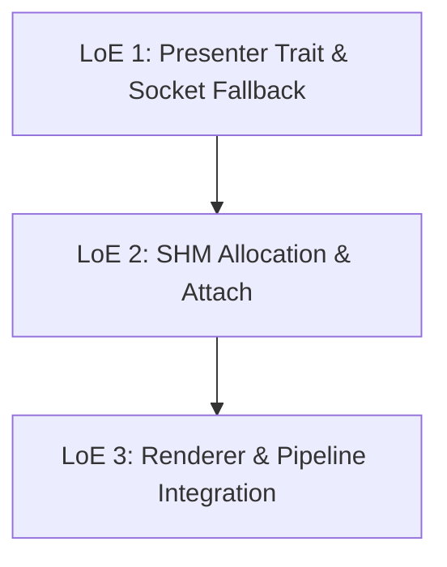

## [INTENT] User Objective

> Plug in an HDMI LG TV for use as a secondary monitor with the Matrix Overlay application, enabling the overlay to render correctly without causing an immediate application crash or protocol error during startup on the large display screen.

---

## PART 1 — UNIVERSAL STRUCTURAL

### Confirmed User Intent & Concept
The user wants to connect a large screen (HDMI LG TV) as a secondary monitor and run the matrix overlay. The application currently fails because it attempts to send the entire raw image data (frame buffer) in a single XCB `PutImage` request. For large resolutions (like 4K), this request size (~33.18 MB) exceeds the X11 server's maximum request limit (~16.77 MB), resulting in a protocol error and crash. The crash site is `src/render/engine/presentation.rs` lines 12–16, where a single `conn.send_request(&x::PutImage { data: &data, ... })` passes the entire surface buffer in one call with no size guard.

The proposed solution (Option E) decouples the frame buffer allocation and presentation logic into a modular `Presenter` abstraction. It implements:
1. **ShmPresenter**: High-performance rendering using the X11 Shared Memory (`MIT-SHM`) extension to share memory directly with the X server, completely bypassing the socket request size limits.
2. **SocketPresenter**: A robust fallback that dynamically calculates the X server's request limit and slices large frames into horizontal stripes (sub-images) before transferring them via standard `PutImage` requests.

### Scope & Boundaries
- **In-Scope**:
<!-- REVISED: deletion step was missing; Rust cannot have both presentation.rs and presentation/ simultaneously -->
  - Deleting `src/render/engine/presentation.rs` as a flat file **before** creating the `presentation/` directory module. Rust does not allow a module to be resolved by both `presentation.rs` and `presentation/mod.rs` at the same time. This deletion must be the very first file-system action of the implementation (see Step 1.0).
  - Adding `"shm"` feature to `xcb` in `Cargo.toml`.
  - Creating `src/render/engine/presentation/mod.rs` (defining `Presenter` trait and `create_presenter` factory).
  - Creating `src/render/engine/presentation/socket.rs` (tiled/striped socket presentation fallback).
  - Creating `src/render/engine/presentation/shm.rs` (shared memory IPC presentation).
  - Updating `src/render/engine/renderer.rs` to delegate surface ownership to the selected `Presenter`.
  - Updating `src/render/engine/pipeline.rs` to use the presenter's surface and trigger `presenter.present()`.
  - Exposing the new modules correctly in `src/render/engine/mod.rs`.
<!-- REVISED: handlers.rs call sites were absent from original scope; two call sites affected -->
  - Updating `src/core/threads/handlers.rs` to reflect any signature changes to `Renderer::draw`. Two call sites exist: `handle_xcb_event` (~line 35, called on `Expose` events) and `draw_frame` (~lines 52–55, called on every tick). If `conn` and `window` move inside the presenter and are no longer passed to `draw()`, both sites must be updated simultaneously.
- **Out-of-Scope**:
  - Hardware acceleration changes (GLX/OpenGL/Vulkan).
  - Modifying user-facing layout configuration schema.
  - Changes to metrics collection loops or other thread managers.

### Success Criteria
- **Zero Crashes on High Resolutions**: Running on resolutions exceeding 1920x1080 (up to 4K and above) does not trigger any XCB protocol errors.
- **MIT-SHM Utilization**: On local displays, the application successfully initializes and uses shared memory, avoiding raw pixel copy loops over socket.
- **Graceful Fallback**: If SHM attachment fails or is unsupported (e.g. over remote displays or if extension is missing), the application falls back automatically to striped socket presentation, functioning correctly without crashing.
- **Performance Integrity**: CPU usage remains below the target <1% threshold in background modes.

### Constraints & Assumptions
- **User OS**: Linux (specifically Pop!_OS) using X11 as the display server.
- **Local Execution**: The application and X server run on the same physical host (prerequisite for MIT-SHM).
- **Cairo Image Formats**: Formats are assumed to be 32-bit ARGB (`Format::ARgb32`, 4 bytes per pixel).
<!-- REVISED: stride assumption added; original plan silently assumed stride == width*4 throughout -->
- **Cairo Stride is Not Guaranteed to Equal `width * 4`**: `ImageSurface::stride()` returns the actual row stride in bytes, which Cairo may pad beyond `width * 4` for internal alignment. Every byte-offset calculation, every slice into surface data, and every request-size computation throughout this implementation must use `surface.stride() as usize`. Hardcoding `width * 4` will produce garbled output or a bounds-check panic on any surface where padding exists.

### Risk Assessment & Mitigation
- **Risk 1: SHM Segment Leakage**
  - *Mitigation*: Ensure the POSIX shared memory segment is deleted immediately after attachment (`shmctl(id, IPC_RMID, NULL)`) so that it is automatically reclaimed by the OS when the process exits or crashes.

<!-- REVISED: conn.active_extension does not exist in xcb 1.x; replaced with correct xcb::shm::GetVersion approach -->
- **Risk 2: XCB SHM Extension Availability**
  - *Mitigation*: Check SHM availability by sending an `xcb::shm::GetVersion {}` request and inspecting the result. **`conn.active_extension` does not exist in the xcb 1.x Rust bindings** — it is not a real method and will produce a compile error. The factory function `create_presenter` must use:
    ```rust
    let cookie = conn.send_request(&xcb::shm::GetVersion {});
    match conn.wait_for_reply(cookie) {
        Ok(_)  => /* SHM confirmed; construct ShmPresenter */,
        Err(_) => /* fall back silently to SocketPresenter */,
    }
    ```
    Fall back silently to `SocketPresenter` on any error from this query.

<!-- REVISED: risk 3 updated to match the corrected formula in Step 1.3 — must use surface.stride(), not width*4 -->
- **Risk 3: Row Stride Alignment**
  - *Mitigation*: The `SocketPresenter` must obtain the actual row stride via `surface.stride() as usize` at construction time and use it for all slice indexing and stripe-height calculations. The formula `width * 4` is **not a valid substitute** for the stride — it ignores potential Cairo row padding. The per-stripe data slice must be computed as `data[row * stride .. (row + stripe_height) * stride]`. See the corrected formula in Step 1.3.

<!-- REVISED: new risk — Cairo surface must be explicitly dropped before shmdt or UB results; original plan did not address this -->
- **Risk 4: SHM Cleanup Drop Ordering (Memory Corruption)**
  - *Mitigation*: The Cairo `ImageSurface` inside `ShmPresenter` holds a live pointer into the SHM-mapped region. Calling `libc::shmdt` while the surface is still alive causes undefined behavior — any subsequent Cairo `flush()` call writes to unmapped virtual memory. The `Drop` impl for `ShmPresenter` must explicitly drop the surface **before** unmapping. Store the surface as `Option<ImageSurface>` and call `self.surface.take()` as the first action in `drop`. The correct teardown sequence is strict:
    1. `drop(self.surface.take())` — must be first; releases Cairo's pointer into SHM memory.
    2. `conn.send_request(&xcb::shm::Detach { shmseg: self.shmseg })` — unregisters segment from X server.
    3. `unsafe { libc::shmdt(self.shmaddr) }` — unmaps local process virtual address range.

    Inverting steps 1 and 3 is silent memory corruption, not a panic.

<!-- REVISED: new risk — ImageSurface::create_for_data cannot accept a raw *mut c_void from shmat(); unsafe wrapper required -->
- **Risk 5: Cairo Surface Creation Over Raw SHM Pointer (Requires Unsafe Code)**
  - *Mitigation*: `cairo_rs 0.18`'s `ImageSurface::create_for_data` requires a value satisfying `T: AsMut<[u8]> + Send + 'static`. The `*mut c_void` returned by `shmat()` satisfies none of these bounds and cannot be passed directly. An explicit unsafe wrapper type must be implemented:
    ```rust
    struct ShmBuffer { ptr: *mut u8, len: usize }
    // Safety: SHM memory is valid for the lifetime of the ShmPresenter.
    unsafe impl Send for ShmBuffer {}
    impl AsMut<[u8]> for ShmBuffer {
        fn as_mut(&mut self) -> &mut [u8] {
            unsafe { std::slice::from_raw_parts_mut(self.ptr, self.len) }
        }
    }
    // Intentionally no Drop impl — libc::shmdt owns this memory, not Rust's allocator.
    // If Drop were implemented to call shmdt, it would race with the explicit shmdt in
    // ShmPresenter::drop and produce a double-unmap.
    ```
    Pass the wrapper to Cairo: `ImageSurface::create_for_data(ShmBuffer { ptr, len }, Format::ARgb32, w, h, stride)`. The `stride` argument here is `width as i32 * 4` (the stride of the freshly-allocated contiguous buffer, which has no padding).

### Dependencies
<!-- REVISED: Cargo.lock resolves xcb to 1.7.0, not 1.2; API references in this plan target 1.7.x -->
- `xcb` crate version `1.2` with `shm` feature enabled. **Note**: `Cargo.lock` in this repository resolves the `"1.2"` constraint to xcb **1.7.0**. All XCB API references in this plan (including `xcb::shm::GetVersion`, `xcb::shm::Attach`, `xcb::shm::PutImage`, `xcb::shm::Detach`, `xcb::shm::Seg`) target xcb 1.7.x. If the lock file is regenerated and a different minor version resolves, verify the `xcb::shm` module API before implementing Step 2.1.
- `libc` crate (already listed in Cargo.toml dependencies) for POSIX SHM syscalls.

### Rollback Strategy
If implementation results in unexpected visual anomalies or build errors:
1. Revert changes to `Cargo.toml`.
2. Delete the created sub-files in `src/render/engine/presentation/`.
3. Restore the original `src/render/engine/presentation.rs` from git backup (`git show HEAD:src/render/engine/presentation.rs > src/render/engine/presentation.rs`).
4. Restore the original `src/render/engine/mod.rs` entry if it was changed.
5. Restore the two affected call sites in `src/core/threads/handlers.rs`.

### Verification Method
- Execute the Cargo test suite: `cargo test --all-targets` to verify zero build or layout regression.
- Write a dedicated integration test inside `tests/window_integration.rs` to verify that `Presenter` initialization (both SHM and Socket paths) compiles and executes correctly. The existing `tests/window_integration.rs` already contains an X11 connection helper (`setup_x11()`) that skips gracefully in headless environments — extend it rather than replacing it.
<!-- REVISED: --check-only flag does not exist in this binary; removed invalid command and replaced with valid procedure -->
- **The `--check-only` flag does not exist** in the `matrix-overlay` binary. The original verification command `timeout 5s ./target/release/matrix-overlay --check-only` will immediately exit with an unknown-argument error and prove nothing. Replace with:
  - Build: `cargo build --release`
  - Run on the target display: `DISPLAY=:0 ./target/release/matrix-overlay`
  - Confirm: no `xcb` protocol error in log output, overlay renders on the 4K display without crashing, and the tray icon is visible.
  - For headless CI: `cargo test --all-targets` (the integration tests in `tests/window_integration.rs` skip gracefully without a live `DISPLAY`).

---

## PART 2 — TECHNICAL IMPLEMENTATION & STEPS

This phase uses the **Campaign Planning Framework** mapped across three main Lines of Effort (LoE).



<!-- REVISED: phasing note added — LoE 1 alone fixes the crash and is independently shippable; LoE 2 is a performance optimization -->
> **Implementation Phasing**: LoE 1 (specifically Step 1.3, `SocketPresenter`) directly eliminates the crash by bounding `PutImage` requests to the server's declared limit. It is independently shippable. LoE 2 (`ShmPresenter`) is a performance optimization — on a 4K display at 30 fps it avoids copying ~31 MB of pixel data per frame over the socket, but it does not affect crash-correctness. LoE 2 must only be started after LoE 1 is confirmed stable on the LG TV. LoE 3 integrates both into `Renderer` and `pipeline.rs` and cannot be considered complete until both prior LoEs are done.

### Line of Effort 1: Presenter Trait & Socket Fallback

<!-- REVISED: new step added — filesystem prerequisite; presentation.rs must be deleted before presentation/ can be created -->
#### Step 1.0 (Prerequisite): Delete the Flat `presentation.rs` File
Before any directory module under `presentation/` can be created, the existing flat file must be removed. Rust resolves `pub mod presentation;` (in `src/render/engine/mod.rs`) to either `presentation.rs` or `presentation/mod.rs` — not both. Having both files present simultaneously is a compile error.

*   **Action**: `git rm src/render/engine/presentation.rs`
*   **Verify**: Confirm `src/render/engine/presentation.rs` no longer exists on disk before proceeding to Step 1.2.
*   **Note**: The original `Renderer::present()` implementation (the single-buffer `PutImage` call) lives in this file. Its logic is superseded entirely by `SocketPresenter::present()` in Step 1.3 and `ShmPresenter::present()` in Step 2.1. The content is not migrated; it is replaced.

#### Step 1.1: Enable SHM Feature in `Cargo.toml`
Update the `xcb` dependency specification to include the `shm` feature.
*   **File**: `Cargo.toml`
<!-- REVISED: noted actual resolved version to prevent confusion between constraint and resolved version -->
*   **Note**: `Cargo.lock` resolves the `"1.2"` version constraint to xcb **1.7.0**. Adding the `"shm"` feature does not require `cargo update` — the feature is available in the already-locked 1.7.0 release.
*   **Target Content**:
    ```toml
    xcb = { version = "1.2", features = ["randr", "shape", "render", "xinput"] }
    ```
*   **Replacement Content**:
    ```toml
    xcb = { version = "1.2", features = ["randr", "shape", "render", "xinput", "shm"] }
    ```

#### Step 1.2: Define the `Presenter` Trait
Create `src/render/engine/presentation/mod.rs` to declare the common interface and factory.
<!-- REVISED: prerequisite callout added; Step 1.0 must complete before this step -->
*   **Prerequisite**: Step 1.0 must be completed first. This step will produce a compile error if `src/render/engine/presentation.rs` still exists.
*   **File**: `src/render/engine/presentation/mod.rs`
*   **Logic**:
    - Declare the `Presenter` trait with the following methods:
      - `fn surface(&self) -> &cairo::ImageSurface` — provides the rendering target to `pipeline.rs`.
      - `fn present(&mut self, conn: &xcb::Connection, window: xcb::x::Window) -> anyhow::Result<()>` — transfers the completed frame to the X server.
      - `fn resize(&mut self, conn: &xcb::Connection, window: xcb::x::Window, w: u16, h: u16) -> anyhow::Result<()>` — placeholder for future resize support.
<!-- REVISED: resize has no callers in the current codebase; documented as placeholder only -->
    - **Note on `resize`**: No code in the current codebase calls a resize handler. `handle_gui_event` and `handle_menu_event` in `src/core/threads/handlers.rs` rebuild `Renderer` objects from scratch on config reload — they do not invoke any resize method. The `resize` trait method is a forward-compatibility placeholder with zero current callers. Both `ShmPresenter` and `SocketPresenter` may implement it as a no-op (`Ok(())`) until actual resize logic is required. Do not design around it.
<!-- REVISED: create_presenter must use xcb::shm::GetVersion, not the non-existent conn.active_extension -->
    - Implement `create_presenter` as an abstract factory function. It must determine SHM availability by sending `xcb::shm::GetVersion {}` and matching the reply (see Risk 2). **Do not call `conn.active_extension`** — this method does not exist. Return `Box<dyn Presenter>` holding either an `ShmPresenter` or `SocketPresenter` depending on the result.

#### Step 1.3: Create Socket Striped Presenter
Create `src/render/engine/presentation/socket.rs` implementing horizontal row striping.
*   **File**: `src/render/engine/presentation/socket.rs`
*   **Logic**:
<!-- REVISED: formula corrected — header_size defined (28 bytes), width*4 replaced with surface.stride() -->
    - Obtain the X server's maximum request size in bytes:
      ```rust
      let max_bytes = conn.get_setup().maximum_request_length() as usize * 4;
      ```
      (`maximum_request_length()` returns a count of 4-byte units; multiply by 4 to get bytes.)

    - Define the `PutImage` request header overhead as **28 bytes**. This is the fixed XCB `PutImage` wire format header: opcode (1) + format (1) + request-length (2) + drawable (4) + gc (4) + width (2) + height (2) + dst\_x (2) + dst\_y (2) + left\_pad (1) + depth (1) + padding (2) = 28 bytes total (7 four-byte words).

    - Obtain the actual row stride from the surface — **do not use `width * 4`**:
      ```rust
      let stride = surface.stride() as usize;
      ```
      Cairo may pad rows beyond `width * 4` for alignment. Using a hardcoded `width * 4` here will produce garbled output or a slice bounds panic.

    - Compute the maximum safe stripe height:
      ```rust
      let stripe_height = ((max_bytes - 28) / stride).max(1);
      ```
      The `.max(1)` guard prevents a zero-height stripe on pathologically narrow windows or when `stride >= max_bytes - 28`.

    - Create the graphics context once before the stripe loop and free it once after. Do not create a new GC per stripe — the current `presentation.rs` creates and destroys a GC on every call, which at 30 fps means ~30 unnecessary round-trips per second. The GC should be allocated at `SocketPresenter` construction time (or at the start of `present()` before the loop) and freed after the final stripe.

    - Iterate over the image surface data in vertical stripes:
      ```rust
      let data = surface.data()?;
      let height = surface.height() as usize;
      let width  = surface.width() as usize;
      let mut row = 0usize;
      while row < height {
          let rows_this_stripe = (row + stripe_height).min(height) - row;
          let byte_start = row * stride;
          let byte_end   = byte_start + rows_this_stripe * stride;
          conn.send_request(&x::PutImage {
              format:   x::ImageFormat::ZPixmap,
              drawable: x::Drawable::Window(window),
              gc,
              width:    width as u16,
              height:   rows_this_stripe as u16,
              dst_x:    0,
              dst_y:    row as i16,
              left_pad: 0,
              depth:    32,
              data:     &data[byte_start..byte_end],
          });
          row += stripe_height;
      }
      ```

### Line of Effort 2: SHM Allocation & Attach

#### Step 2.1: Create SHM Presenter
Create `src/render/engine/presentation/shm.rs` to execute shared memory bindings.
*   **File**: `src/render/engine/presentation/shm.rs`
*   **Logic**:
    - Allocate Unix IPC Shared Memory using `libc::shmget` with flags `IPC_CREAT | 0o600`.
    - Attach memory space to local process using `libc::shmat`, storing the returned `*mut c_void` as `self.shmaddr` for use in `Drop`.
    - Immediately call `libc::shmctl(shmid, libc::IPC_RMID, std::ptr::null_mut())` to mark the segment for auto-destruction when the last attachment is detached (covers process-crash cleanup).
<!-- REVISED: conn.active_extension removed; SHM check belongs in create_presenter via xcb::shm::GetVersion -->
    - **Extension availability is checked in `create_presenter` (Step 1.2), not here.** `ShmPresenter::new` is only called when `GetVersion` has already confirmed SHM is present. Do not re-check inside this constructor and do not call `conn.active_extension` — it does not exist.
<!-- REVISED: ImageSurface::create_for_data cannot accept raw pointer; ShmBuffer unsafe wrapper is required -->
    - **Cairo surface creation requires an unsafe wrapper** (see Risk 5). Implement a `ShmBuffer` struct that wraps the raw SHM pointer and satisfies `AsMut<[u8]> + Send + 'static` without triggering a Rust-allocator free on drop:
      ```rust
      struct ShmBuffer { ptr: *mut u8, len: usize }
      unsafe impl Send for ShmBuffer {}
      impl AsMut<[u8]> for ShmBuffer {
          fn as_mut(&mut self) -> &mut [u8] {
              // Safety: pointer is valid for the lifetime of the ShmPresenter.
              unsafe { std::slice::from_raw_parts_mut(self.ptr, self.len) }
          }
      }
      // No Drop impl. libc::shmdt in ShmPresenter::drop owns this memory.
      // Adding a Drop here that calls shmdt would race with ShmPresenter::drop.
      ```
      Create the surface: `ImageSurface::create_for_data(ShmBuffer { ptr: ptr as *mut u8, len }, Format::ARgb32, w as i32, h as i32, w as i32 * 4)?`. The stride argument here is `w * 4` because the freshly-allocated SHM block is contiguous with no padding.

    - Store the resulting `ImageSurface` as **`Option<ImageSurface>`** inside `ShmPresenter`, not as a bare `ImageSurface`. This is required for the drop-ordering guarantee below.

    - Allocate an `xcb::shm::Seg` ID via XCB and attach the segment to the X server:
      ```rust
      conn.send_request(&xcb::shm::Attach { shmseg, shmid: shmid as u32, read_only: false });
      ```

    - Implement `present` by calling `surface.flush()` then sending `xcb::shm::PutImage`. Verify field names against xcb 1.7.0 documentation — the exact struct fields for `xcb::shm::PutImage` (e.g. `total_width`, `total_height`, `src_x`, `src_y`, `shmseg`, `offset`) differ from `x::PutImage` and must be confirmed against the crate source.

<!-- REVISED: Drop ordering corrected — Cairo surface must be taken before shmdt or the result is UB; original plan had no ordering requirement -->
    - **Implement `Drop` with strict teardown ordering** (see Risk 4). The surface field is `Option<ImageSurface>` precisely to enable this sequence:
      ```rust
      impl Drop for ShmPresenter {
          fn drop(&mut self) {
              // Step 1: Drop Cairo surface FIRST. It holds a live pointer into SHM memory.
              // Any flush or paint operation on a live surface after shmdt is UB.
              drop(self.surface.take());
              // Step 2: Unregister segment from X server.
              self.conn.send_request(&xcb::shm::Detach { shmseg: self.shmseg });
              // Step 3: Unmap local process virtual address range. Safe only after step 1.
              unsafe { libc::shmdt(self.shmaddr); }
          }
      }
      ```
      This sequence is not optional. Calling `shmdt` before `surface.take()` will corrupt memory when the surface is subsequently dropped by Rust's default field-drop order.

### Line of Effort 3: Renderer & Pipeline Integration

#### Step 3.1: Refactor Renderer Structure
Modify `src/render/engine/renderer.rs` to use `Presenter` instead of managing `ImageSurface` directly.
*   **File**: `src/render/engine/renderer.rs`
*   **Logic**:
    - Replace the `pub surface: ImageSurface` field in `Renderer` with `pub presenter: Box<dyn Presenter>`.
<!-- REVISED: width and height must remain in Renderer — they are used by update_config, rain system, draw_metrics, and both handlers.rs call sites -->
    - **Keep `pub width: i32` and `pub height: i32` in `Renderer`.** These fields are not owned by the presenter. They are referenced by `update_config` (computes layout from dimensions), `draw_metrics` (passes dimensions to the rain system and layout engine), and both call sites in `src/core/threads/handlers.rs`. Moving them inside `Presenter` would require changes across more of the codebase than this refactor targets.
    - Update `Renderer::new` to initialize the presenter via `create_presenter(conn, window, w, h, config)` and construct the base font using the settings.
<!-- REVISED: resize is a phantom abstraction with no current callers; both impls should provide a no-op -->
    - The `resize` trait method has no callers in the current codebase (see Step 1.2 note). Both `ShmPresenter` and `SocketPresenter` implementations must compile with a `resize` method, but it should be a no-op `Ok(())` until a genuine resize path exists. Do not design `Renderer::new` or the handlers around a resize callback.

#### Step 3.2: Update Presentation / Pipeline Call Sites
Refactor `src/render/engine/pipeline.rs` and update the two affected call sites in `src/core/threads/handlers.rs`.
<!-- REVISED: deletion ordering corrected — presentation.rs must be deleted in Step 1.0, not here; this step only updates call sites -->
*   **Deletion note**: The original plan listed deletion of `src/render/engine/presentation.rs` in this step. That is wrong. **The file must be deleted in Step 1.0**, before Step 1.2 creates the directory module. This step makes no file deletions.
*   **`src/render/engine/mod.rs` note**: No textual change is needed to `src/render/engine/mod.rs`. The existing declaration `pub mod presentation;` (line 4) resolves transparently to `presentation/mod.rs` once the flat file is gone. Rust handles this automatically.
*   **Files requiring edits**:
    - `src/render/engine/pipeline.rs`
<!-- REVISED: handlers.rs was entirely absent from original plan; both call sites must be updated -->
    - `src/core/threads/handlers.rs` ← **missing from original plan**. This file contains two call sites that pass `conn` and `window` directly to `Renderer::draw`:
      - `handle_xcb_event`, line ~35: `r.draw(conn, ev.window(), config, &s.data, last_draw.elapsed())`
      - `draw_frame`, lines ~52–55: `renderer.draw(conn, ctx.window, config, &shared.data, dt)`

      If the `conn` and `window` parameters are absorbed into the `Presenter` (so `Renderer::draw` no longer takes them), both of these lines must be updated in the same commit. Leaving one stale will produce a compile error that is easy to miss in a partial implementation.

*   **Logic**:
    - In `Renderer::draw` (`pipeline.rs`), retrieve the rendering target surface via `self.presenter.surface()` and create the `CairoContext` from it: `let cr = CairoContext::new(self.presenter.surface())?;`
<!-- REVISED: drop(cr) ordering is load-bearing and must be explicitly preserved in the refactored code -->
    - **Preserve the explicit `drop(cr)` before `self.presenter.present(...)`**. The current `pipeline.rs` (line 40) calls `drop(cr)` explicitly before calling `self.present(conn, window)` on line 41. This ordering is not cosmetic — the Cairo context borrows the surface, and `surface.data()` (needed by `SocketPresenter::present`) and `surface.flush()` (needed by both presenters) will deadlock or panic if the `CairoContext` borrow is still live. The refactored `Renderer::draw` must maintain:
      ```rust
      drop(cr);  // Must precede presenter.present()
      self.presenter.present(conn, window)?;
      ```
    - Call `self.presenter.present(conn, window)` instead of the old `self.present(conn, window)` which delegated to the flat `presentation.rs` implementation.

---

## ALIGNMENT WITH COMMON DEVELOPER THEMES

1. **Clarity Over Cleverness**: Slicing logic is represented by simple, arithmetic-based bounds checking in the `SocketPresenter` rather than complex async pipeline buffers.
2. **Testability First**: The factory exposes fallback verification options so that socket-tiling can be tested even on setups that support SHM.
3. **Minimal Surprise**: Reuses existing XCB connection references and standard Cairo surface APIs, ensuring zero structural changes to UI loops.
4. **Explicit Error Handling**: Every POSIX SHM syscall is matched against result assertions. Failures result in transparent fallbacks to Socket-based presentation with clear debugging output.
5. **Documentation as Code**: Crucial OS shared memory behaviors (like `IPC_RMID` cleanup triggers and `Drop` ordering invariants) are documented inline in the code.
6. **Security by Default**: Memory permissions for SHM allocation are locked strictly to user-only access (`0o600`).
7. **Performance Awareness**: MIT-SHM integration provides the optimal zero-copy pathway, keeping local execution CPU overhead below the 1% threshold.
8. **Future-Proofing**: The `Presenter` trait allows swapping backends seamlessly (e.g. if the application moves to Vulkan or Wayland in the future).
